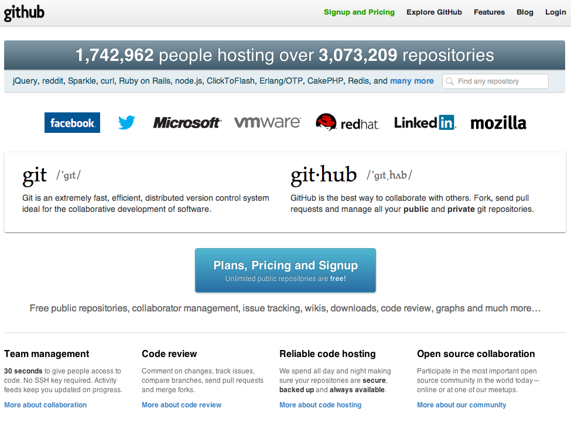
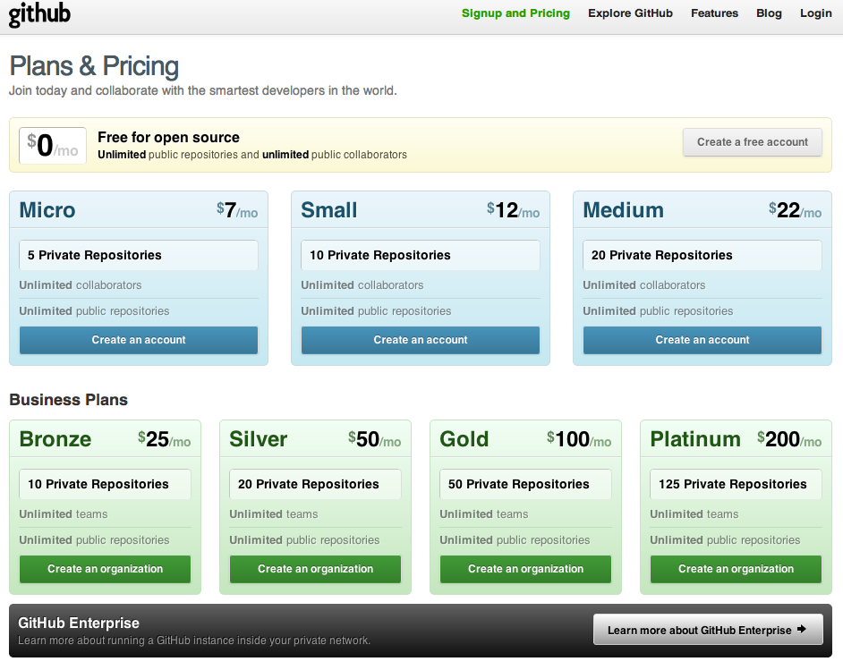
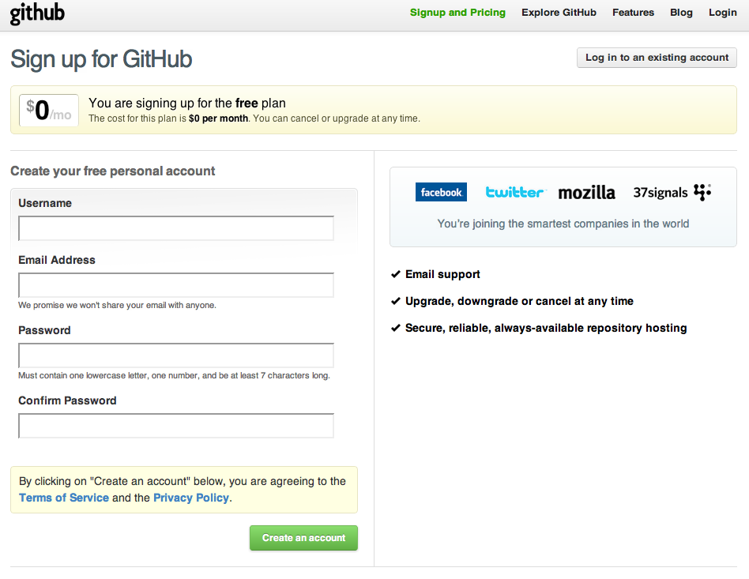
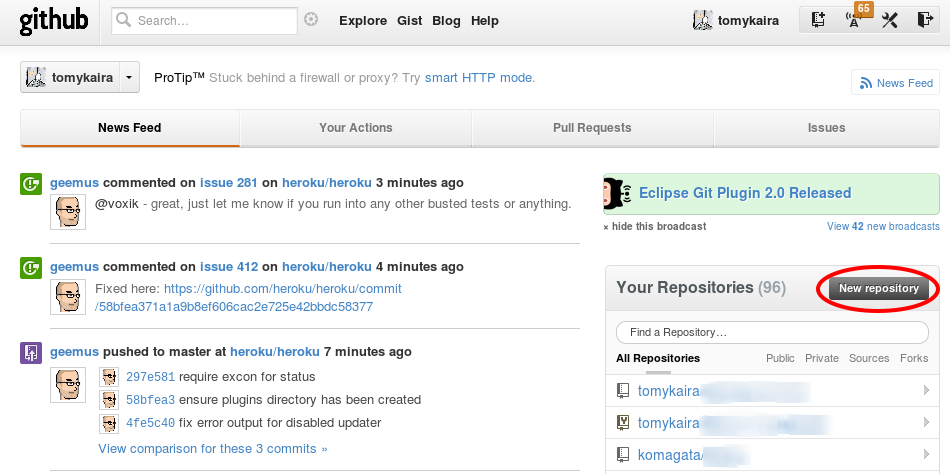
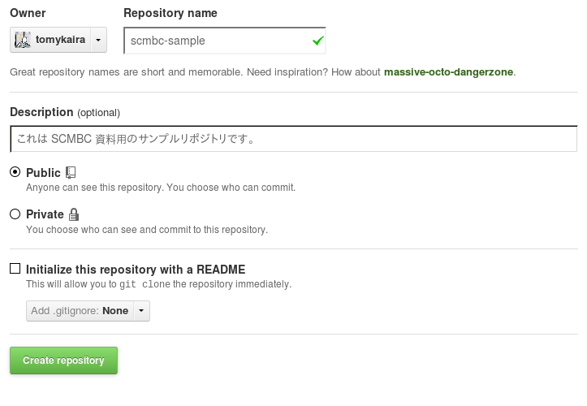
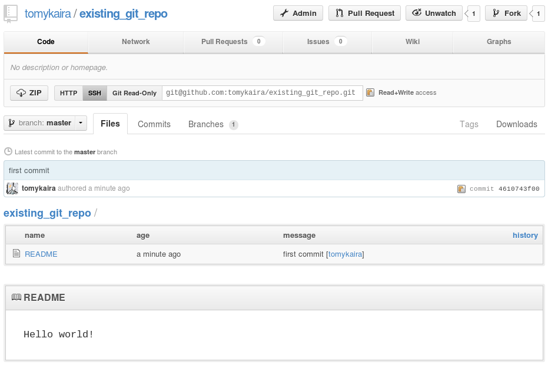
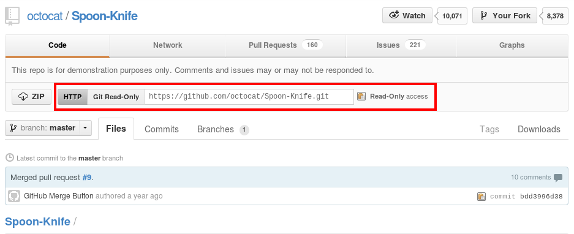

============
Githubの利用
============

アカウントの作成
================

1. https://github.com にアクセスします。

  |github-001|

2. 画面中央にある"Plans, Pricing and Signup"をクリックします。

  |github-002|

3. 画面右上にある"Create a free account"をクリックします。

  |github-003|

4. 入力フォームに必要な情報を入力します。

5. 以上でGithubのアカウンの作成は完了です。

Githubアカウントの設定
======================

先ほど作成したアカウント情報をgitに設定します。

  ::

    git config --global user.name "ユーザネーム"
    git config --global user.email "メールアドレス"

.. note::

  ここで指定するメールアドレスは正しいメールアドレスである必要はありません。
  もし公開したくない場合は"someone@gmail"のように設定すると良いでしょう。

.. note::

  もしリポジトリ個別に設定したい場合は、対象とするリポジトリのディレクトリに移動した後
  以下のようにglobalオプションを外して実行することで行うことができます。

  ::

    git config user.name "ユーザネーム"
    git config user.email "メールアドレス"

以上でGithubアカウントのGitに対する設定は完了です。

パスワードのキャッシュ
----------------------

.. warning::

  この設定はgitのバージョンが1.7.10以降の場合のみ利用可能です。
  Gitのバージョンを確認するには以下のコマンドを実行します。

  ::

    git --version

パスワードのキャッシュ機能を利用するには以下のコマンドを実行します。

::

  git config --global credential.helper cache

デフォルトでは15分の間1度入力したパスワードをキャッシュしてくれます。
この設定を変更したい場合は以下のコマンドを実行します。

::

  git config --global credential.helper 'cache --timeout=3600'

時間の単位は秒で指定するので上記の例では1時間パスワードをキャッシュしてくれるようになります。

.. note::

  パスワードのキャッシュ機能については Githubのヘルプ_ にプラットフォーム毎の
  設定が詳しく書かれています。英語で書かれていますが、興味ある方はそちらも合わせて
  確認してみると良いでしょう。

以上でGithubアカウントの設定は完了です。

.. _Githubのヘルプ: https://help.github.com/articles/set-up-git

Github にリポジトリをつくる
==========================

github ではウェブインタフェースからリポジトリの管理ができます。
まずはリポジトリの作成と、そこへのコミットを試してみます。

トップページの New Repository ボタンを押します。

  |github-newrepo|

作成ページに飛びます。
Repository Name に作成したいリポジトリの名前、Description に説明を記入します。

Private にすると他人には見えないリポジトリを作れますが、月額料金がかかります。
README の自動作成や .gitignore (ビルドの中間ファイルなど、コミットしたくないファイルを指定する)
の自動作成機能もついたようです。慣れたら遊んでみてください。

  |github-create|

無事リポジトリの作成が終わると、次のような「まずどうする?」の説明が出ます。

::

  Next steps:

    mkdir scmbc-sample
    cd scmbc-sample
    git init                      # git リポジトリを作成する
    touch README
    git add README                # README ファイルを追加する
    git commit -m 'first commit'  # コミットをおこなう
    git remote add origin git@github.com:tomykaira/scmbc-sample.git # github に作成したリポジトリに push できるように設定
    git push -u origin master     # push する

  Existing Git Repo?
  
    cd existing_git_repo          # すでにあるリポジトリに移動
    git remote add origin git@github.com:tomykaira/scmbc-sample.git
    git push -u origin master     # push

まだローカルにリポジトリがない場合は、``Next steps:`` に進みます。
すでにローカルでリポジトリがつくってあって、作業をすすめている場合は``Existing Git Repo?`` のほうの操作をおこないます。
基本的にはここに出てくるコマンドをぜんぶターミナルにコピペすれば OK です。

push というのは外部のリポジトリに手元のリポジトリからコミットのデータを送信することです。
push は自分でリポジトリを作ったときだけでなく、更新したときや、共有リポジトリにデータを送信するときにも使う重要なコマンドです。 ``git push リポジトリ名 ブランチ名`` という使い方を覚えておいてください。

うまく push できたら、ブラウザを更新してみてください。README の内容が次のように表示されるはずです。

  |github_created|

CUI が好きな人は、 hub_ を使ってみてください。
hub_ をつかうと次のような操作になります。

::

  > hub create
  Updating origin
  created repository: tomykaira/existing_git_repo
  > git push origin master -u
  Counting objects: 3, done.
  Writing objects: 100% (3/3), 215 bytes, done.
  Total 3 (delta 0), reused 0 (delta 0)
  To git@github.com:tomykaira/existing_git_repo.git
   * [new branch]      master -> master
  Branch master set up to track remote branch master from origin.

お手軽ですね。

.. _hub: https://github.com/defunkt/hub

Github から clone する
======================

すでにあるリポジトリの中身を使いたい場合、そのリポジトリを手元に clone する必要があります。
だれかと一緒に作業する時も、たいていすでにあるリポジトリを clone して、変更を加えていきます。

中身を見るだけなら github 上でもできますし、簡単な編集なら github にエディタが付いていますが、使い慣れたエディタのほうが作業しやすいですし、ミスも少ないです。

まず clone したいリポジトリのページに行きます。

  |github-clone-address|

この URL をコピーします。コピーボタンでも OK。

ターミナルに、次のように打ち込みます。

::

  git clone https://github.com/octocat/Spoon-Knife.git

すると…

::

  ~/tmp> git clone https://github.com/octocat/Spoon-Knife.git
  Cloning into 'Spoon-Knife'...
  remote: Counting objects: 24, done.
  remote: Compressing objects: 100% (19/19), done.
  remote: Total 24 (delta 7), reused 19 (delta 3)
  Unpacking objects: 100% (24/24), done.
  ~/tmp> ls Spoon-Knife/
  .  ..  forkit.gif  .git  index.html  README

clone できました。必要な変更をして使いましょう。

.. note::

  環境によっては SSL の問題で ``https://`` が使えないことがあります。
  その場合 ``Git Read-Only`` のボタンを押して ``git::`` ではじまる URL でやるとうまくいきます。

Social Coding のかなめは fork です。fork は手元に clone するのではなく、github 上でリポジトリを clone します。
こうすることでコミット権のないリポジトリを変更し、それをみんなに見てもらうことができます。
より詳しい説明は、 `Fork A Repo`_ を参照してください。

.. _Fork a repo: https://help.github.com/articles/fork-a-repo
